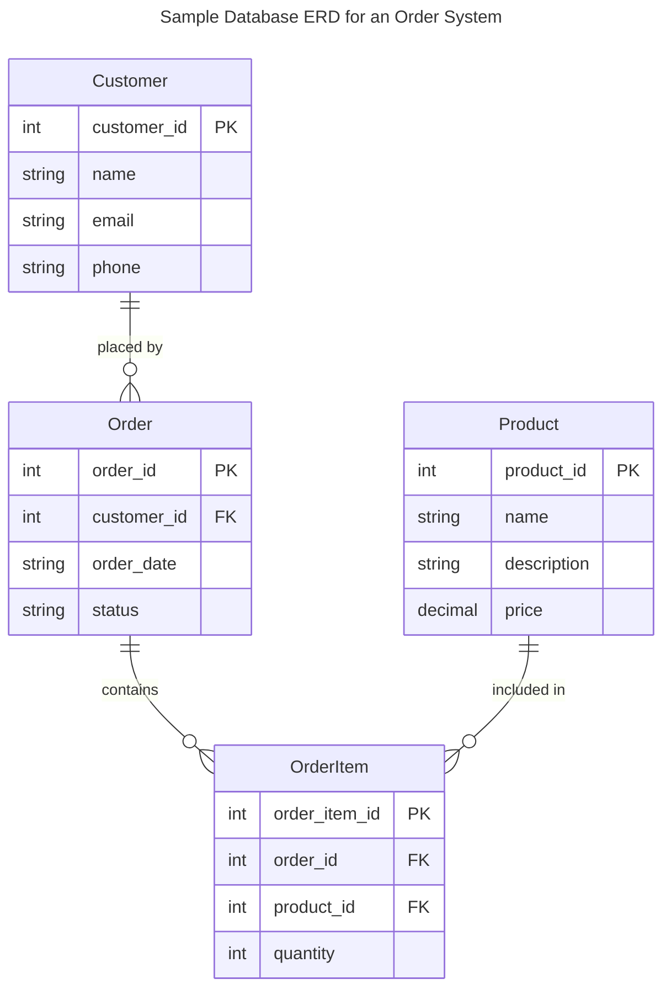
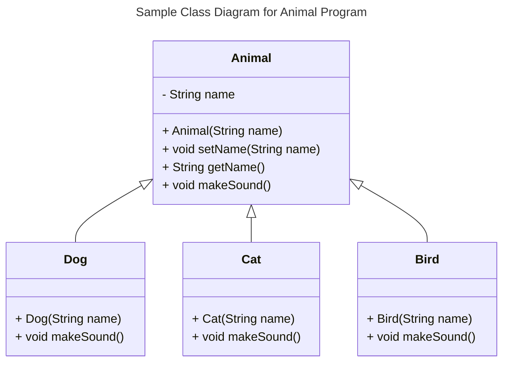
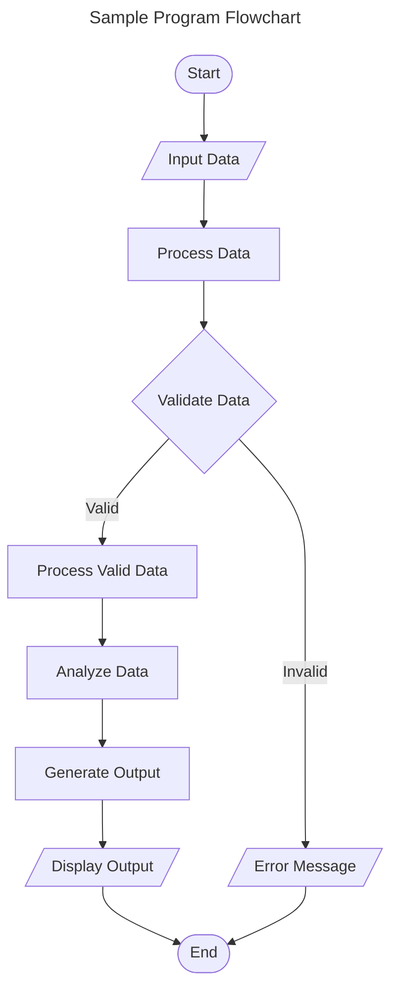
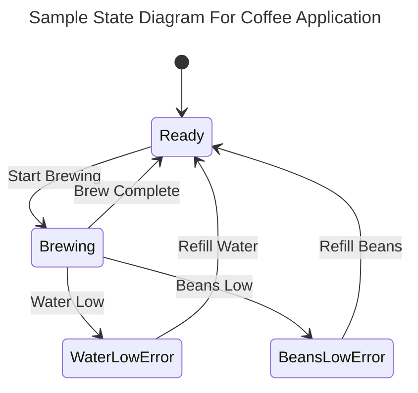

# Requirements and Specification Document

## TeamName

The 37ers

### Project Abstract & Customer

This software management platform is meant to serve the aircraft industry specifically aircraft manufacturers. The lifecycle of the construction of an airplane is very complex and keeping track of all the process data is even more cumbersome. Top level management requires a way to clearly see their model/part inventory across all their warehouses in order to adjust to customer orders, preferences and requests. Being able to check the statuses of prodcution lines, model performances and current market trends are vital to the success of a manufacturing business therefore KPIs are generated in order to help managers streamline their processes. Finally, our platform allows administrators to order parts, viewing price fluctuations and better manage their upply inventory. 

### User Requirements

<!--This section lists the behavior that the users see. This information needs to be presented in a logical, organized fashion. It is most helpful if this section is organized in outline form: a bullet list of major topics (e.g., one for each kind of user, or each major piece of system functionality) each with some number of subtopics.-->

| ID   | Description                                                  | Priority | Status |
| ---- | ------------------------------------------------------------ | -------- | ------ |
| R01  | The user should be able to see current model/parts inventory | High      | Done   |
| R02  | The user should be able to see where a particular plane is in its development lifecycle. | High     | Done   |
| R03  | The user should be able to see all warehouses and their inventory/staff . | High     | Done   |
| R04  | The user should be able to order new parts from suppliers and understand the finances required. | High      | In Progress   |

### Use Cases & User Stories

<!--Use cases and user stories that support the user requirements in the previous section. The use cases should be based off user stories. Every major scenario should be represented by a use case, and every use case should say something not already illustrated by the other use cases. Diagrams (such as sequence charts) are encouraged. Ask the customer what are the most important use cases to implement by the deadline. You can have a total ordering, or mark use cases with “must have,” “useful,” or “optional.” For each use case you may list one or more concrete acceptance tests (concrete scenarios that the customer will try to see if the use case is implemented).-->

> As a user, I want to be able to view the inventory of planes in single page to see how the production is processed as a whole.
> AC: Aggregated/filter data should be viewable with production stages labeled on a master inventory webpage. R01

> As a user, I want to be able to view current parts on a per warehouse per model basis so I can determine if I need to order more or hold off. 
> AC: Aggregated/filter data should be viewable on a warehouse inventory webpage. R01

> As a user, I want to be able to click on a particular plane in development and view necessary metadata such as model, size, ID, and production stage.
> AC: Create a unique 'plane' webpage where plane metadata is displayed. R01 & R02

> As a user, I want to be able to sort and search the inventory of planes by different categories of invetory.
> AC: Sort/search data should be enabled on both master and warehouse inventory webpage.

> As a user, I want to be able to add new warehouse(s) or delete existing warehouse(s).
> AC: Create or delete warehouse(s) on the warehouse inventory webpage.  R04

> As a user, I want the ability to put in orders with suppliers based on current inventory KPIs and counts. I also want the abiity to add new suppliers if the business facilitates a good connection.
> AC: Use a form to place order and another form to add suppliers R04

### User Interface Requirements

<!--Describes any customer user interface requirements including graphical user interface requirements as well as data exchange format requirements. This also should include necessary reporting and other forms of human readable input and output. This should focus on how the feature or product and user interact to create the desired workflow. Describing your intended interface as “easy” or “intuitive” will get you nowhere unless it is accompanied by details.-->

<!--NOTE: Please include illustrations or screenshots of what your user interface would look like -- even if they’re rough -- and interleave it with your description.-->

Images can be included with ``

### Security Requirements

<!--Discuss what security requirements are necessary and why. Are there privacy or confidentiality issues? Is your system vulnerable to denial-of-service attacks?-->

### System Requirements

<!--List here all of the external entities, other than users, on which your system will depend. For example, if your system inter-operates with sendmail, or if you will depend on Apache for the web server, or if you must target both Unix and Windows, list those requirements here. List also memory requirements, performance/speed requirements, data capacity requirements, if applicable.-->

| You    |    can    |    also |
| ------ | :-------: | ------: |
| change |    how    | columns |
| are    | justified |         |

### Specification

<!--A detailed specification of the system. UML, or other diagrams, such as finite automata, or other appropriate specification formalisms, are encouraged over natural language.-->

<!--Include sections, for example, illustrating the database architecture (with, for example, an ERD).-->

<!--Included below are some sample diagrams, including some example tech stack diagrams.-->

You can make headings at different levels by writing `# Heading` with the number of `#` corresponding to the heading level (e.g. `## h2`).

#### Technology Stack and Sequence Diagram

#### Database

#### Class Diagram

#### Flowchart

#### Behavior

### Standards & Conventions

<!--Here you can document your coding standards and conventions. This includes decisions about naming, style guides, etc.-->
